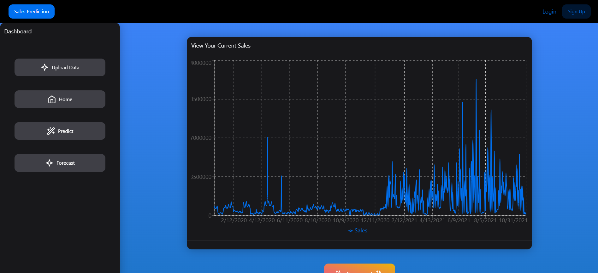

# Sales Prediction Website

Welcome to the Sales Prediction Website repository! This project leverages the power of machine learning to provide accurate sales forecasts and predictions. The application is built using a combination of React for the front-end and Flask for the back-end. It utilizes Long Short-Term Memory (LSTM) networks for future sales forecasting and XGBoost for sales prediction.

## Introduction

This project aims to help businesses make informed decisions by predicting future sales trends and providing insights based on historical data. By employing advanced machine learning models, the application delivers precise and reliable sales forecasts.

## Features

- **Future Sales Forecasting:** Uses LSTM networks to forecast future sales based on historical data.
- **Sales Prediction:** Implements XGBoost to predict sales figures.
- **User-Friendly Interface:** Built with React to provide an intuitive and responsive user interface.
- **RESTful API:** Powered by Flask to handle data processing and model inference.

## Screenshots

### Home Page 
### Upload Data 
### Prediction Results 

## Technologies Used

### Front-End

- React
- Axios (for API requests)
- Chart.js (for data visualization)
- NextUI Library

### Back-End

- Flask
- Flask-RESTful
- Flask-CORS

### Machine Learning

- TensorFlow/Keras (for LSTM)
- XGBoost
- Pandas
- Scikit-learn

## Installation

### Prerequisites

- Node.js and npm
- Python 3.7+
- Virtualenv
